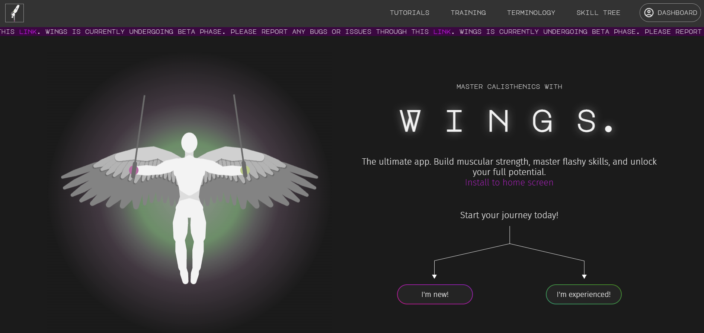

# WINGS

**A calisthenics progression app built for people who train with their bodyweight, not a gym membership.**

[](https://wingssw.com)
[](https://react.dev)
[](https://pages.cloudflare.com)
[](https://firebase.google.com)

<!-- Swap these for real screenshots or a GIF of the app in use -->
<p align="center">
  
  
  
</p>

<p align="center">
  
  
  
</p>

---

## What it is

WINGS is a Progressive Web App for tracking and progressing calisthenics skills — think planches, front levers, and muscle-ups — without needing equipment beyond a bar and your own bodyweight. It grew out of my own training and knowledge, and is now used by a real community: **1,200+ monthly active users** and a **peak of 1,000 daily active users**, backed by a **30k-follower Instagram audience**.

Most fitness apps are built around gym equipment and generic programming. WINGS is built specifically around bodyweight skill progressions, specifically, calisthenics. The information you'll learn here is the kind of structured, prerequisite-based training that elite calisthenics athletes actually follow. What seperates this calisthenics app from others is that here, athletes will actually learn how to train and create their own workout, not just follow other's workout plans. This is self-learning optimized for calisthenics. Enjoy!

## Features

- 🏋️ Skill-based personalized progression tracking (prerequisite chains, grouped by muscle and skill structure)
- 📱 Installable PWA — mobile responsive, intuitive UI
- ⚡ Fast, lightweight — built on Vite for near-instant loads
- ☁️ Real-time sync via Firebase (progress persists across devices)
- 🔥 Daily streak system to encourage daily progress and user engagement
- ⚔️ Competitive ranked system based on streak length and learned skill difficulty
- 🎨 Clean, minimal, aesthetic UI, designed for the user

## Tech stack

| Layer | Tech |
|---|---|
| Frontend | React, Vite |
| Backend / Data | Firebase (Auth, Firestore) |
| Hosting | Cloudflare Pages |
| Delivery | Website & Progressive Web App (mobile-friendly) |


## Traction

| Metric | Value |
|---|---|
| Instagram community | 30,000+ followers |
| Monthly active users | 1,200+ |
| Peak daily active users | 1,400 |

## Local development

Clone and run locally if you want to explore the codebase:

```bash
git clone https://github.com/1prcntethan/wings.git
cd wings
npm install
npm run dev
```

You'll need your own Firebase project credentials in a `.env.local` file .

## Roadmap

- [ ] Add social/leaderboard features
- [ ] Expand progression library

## License

All rights reserved. This code is publicly viewable for portfolio purposes, but is not licensed for reuse, modification, or redistribution without permission.

## Contact

Built by [Ethan Tay](https://github.com/1prcntethan) — [ethantay1prcnt@gmail.com](mailto:ethantay1prcnt@gmail.com) · [LinkedIn](https://linkedin.com/in/ethanjtay)
